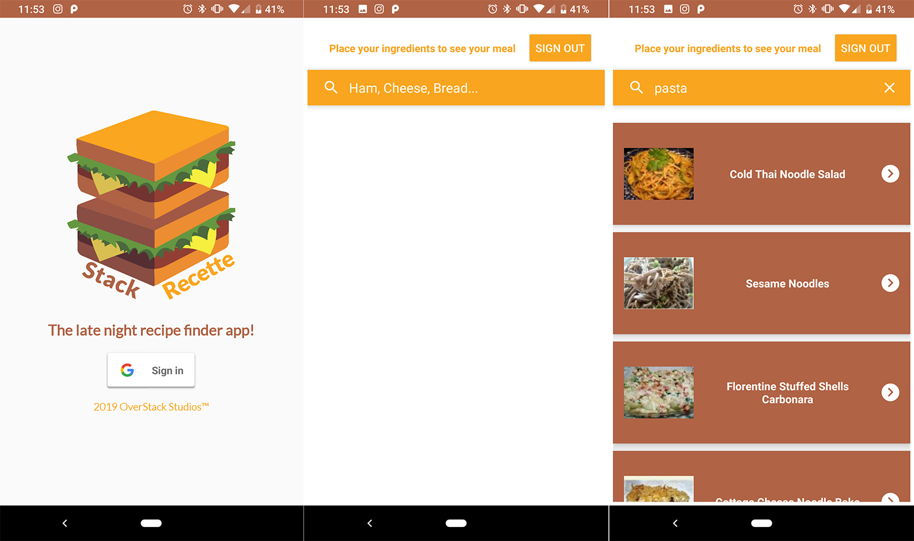

# StackRecette
The purpose of our app will give people the fastest and easiest way to get a recipe from his/her ingredients. The target audience of our app will be anyone who can not figure out what they would like for dinner. In addition, the user does require some cooking experience. 
The user will require an Android phone with Android Ice Cream Sandwich (4.0) or greater. And if you are running an emulator, you need an AVD that runs the Google api, including Google play services version 15 and above.

## Open Source Libraries Used
- Recipe Puppy API (Learn more at: http://www.recipepuppy.com/about/api/)
- SimpleAuth Library by jaychang0917 (Find more from GitHub ReadMe at: https://github.com/jaychang0917/SimpleAuth)

## Main Technologies From Our App
- FireBase
- Java & XML
- Android Studio 3.2

